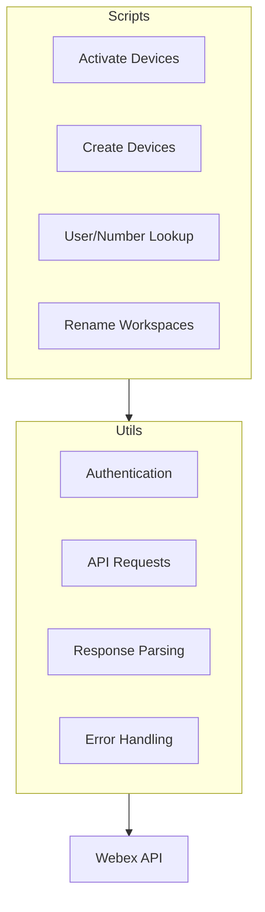
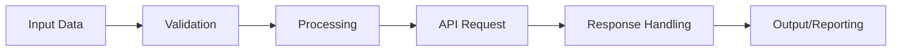

# System Patterns: WebexTools

## Architecture Overview
WebexTools follows a script-based architecture with shared utility functions. Each script is designed to perform a specific task while leveraging common functionality for API interactions.

## Design Patterns

### Command Pattern
Each script acts as a standalone command with specific parameters and functionality. This allows for easy addition of new commands without modifying existing code.

### Utility Library
Common functionality is abstracted into utility functions that handle:
- Authentication
- API request formatting
- Response parsing
- Error handling

### Configuration Management
Environment variables and configuration files are used to manage sensitive information like API keys and default settings.

## Component Relationships

### Script Structure
Each script typically follows this pattern:
1. Parse command-line arguments
2. Initialize API utilities
3. Perform specific operations
4. Handle and report results

### Data Flow

## Error Handling Strategy
- Input validation before API calls
- Graceful handling of API errors
- Clear error messages with suggested resolutions
- Logging of operations for troubleshooting

## Batch Processing Pattern
For operations that need to be performed on multiple items:
1. Read data from CSV or other structured input
2. Process each item individually
3. Collect results and errors
4. Provide summary report

## Authentication Pattern
Authentication is handled through:
- Environment variables for API tokens
- Token validation before operations
- Refresh mechanisms when needed
- Clear error messages for authentication failures

## Extension Points
The system is designed to be extended through:
- Adding new scripts for additional operations
- Enhancing utility functions for broader API coverage
- Implementing new input/output formats
- Creating higher-level workflows that combine multiple operations

This document outlines the key architectural patterns and design decisions that shape the WebexTools project, providing guidance for maintaining consistency as the system evolves.
