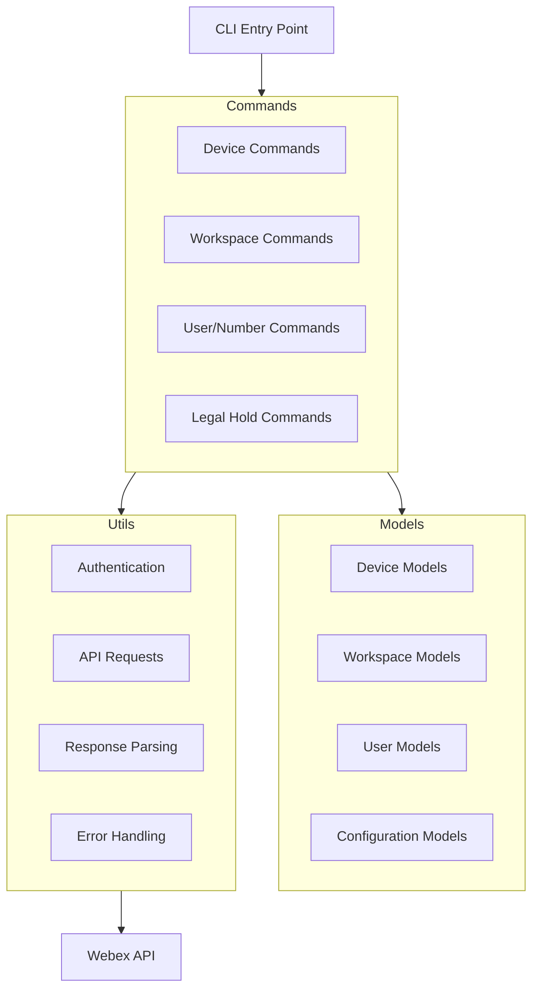
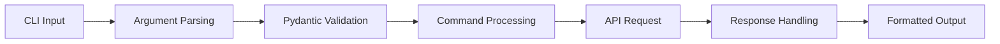

# System Patterns: WebexTools

## Architecture Overview
WebexTools is transitioning from a script-based architecture to a unified CLI tool with a modular command structure. The new architecture uses Poetry for dependency management, rich-click for the CLI interface, and pydantic for data validation.



## Design Patterns

### Command Pattern
The CLI tool uses a command pattern with nested command groups. Each command is implemented as a function with rich-click decorators for argument parsing and help text.

### Model-View-Controller (MVC)
- **Models**: Pydantic models define data structures and validation rules
- **Views**: Rich-click handles command-line interface and output formatting
- **Controllers**: Command functions implement business logic and API interactions

### Dependency Injection
The CLI tool uses dependency injection to provide services (like API clients) to commands, making them easier to test and maintain.

### Configuration Management
Poetry manages project dependencies, while environment variables and configuration files handle sensitive information like API keys and default settings.

## Component Relationships

### Command Structure
The CLI tool follows this hierarchical structure:
```
webex-tools
├── devices
│   ├── activate
│   ├── create-meeting
│   └── create-flex
├── workspaces
│   ├── create
│   └── rename
├── users
│   ├── lookup
│   └── number-lookup
└── legal-hold (future)
    └── process-export
```

### Data Flow


## Error Handling Strategy
- Input validation using pydantic models
- Centralized error handling with rich formatting
- Graceful handling of API errors
- Clear error messages with suggested resolutions
- Logging of operations for troubleshooting

## Batch Processing Pattern
For operations that need to be performed on multiple items:
1. Read data from CSV or other structured input
2. Validate data using pydantic models
3. Process each item individually with progress indication
4. Collect results and errors
5. Provide summary report with rich formatting

## Authentication Pattern
Authentication is handled through:
- Environment variables for API tokens
- Configuration files for persistent settings
- Token validation before operations
- Refresh mechanisms when needed
- Clear error messages for authentication failures

## Extension Points
The system is designed to be extended through:
- Adding new command groups and commands
- Creating new pydantic models for data validation
- Enhancing utility functions for broader API coverage
- Implementing new input/output formats
- Creating higher-level workflows that combine multiple operations

This document outlines the key architectural patterns and design decisions that shape the WebexTools project, providing guidance for maintaining consistency as the system evolves.
